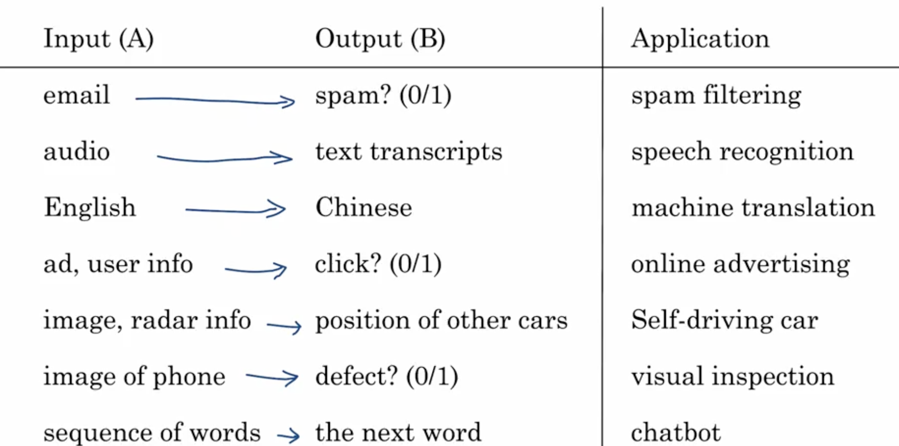

# Semana 1 – O que é Machine Learning

## Introdução

- O crescimento recente da IA foi impulsionado principalmente pelo **machine learning**.
- O tipo mais comum é o **supervised learning**, que aprende mapeamentos de entrada (A) para saída (B).

## Exemplos de Supervised Learning

- **Filtro de spam**: Entrada = e-mail, Saída = spam ou não (0 ou 1).
- **Reconhecimento de fala**: Entrada = áudio, Saída = transcrição de texto.
- **Tradução automática**: Entrada = texto em inglês, Saída = outro idioma.
- **Publicidade online**: Entrada = informações do usuário e do anúncio, Saída = probabilidade de clique.
- **Carros autônomos**: Entrada = imagens e dados de sensores, Saída = localização de outros veículos.
- **Inspeção visual em fábricas**: Entrada = imagem do produto, Saída = presença de defeitos.

## Machine Learning em IA Generativa

- Modelos como o **ChatGPT** usam supervised learning para prever a próxima palavra.
- Baseiam-se em grandes volumes de texto (bilhões de palavras) para aprender padrões de linguagem.
- Chamados de **Large Language Models (LLMs)**.

### Como LLMs são treinados

- Exemplo: frase "My favorite drink is lychee bubble tea" vira múltiplos pares A → B:
  - A = "My favorite drink", B = "is"
  - A = "My favorite drink is", B = "lychee"
  - E assim por diante.

> *Nota: Há técnicas adicionais para instruções, moderação de conteúdo e segurança que são tratadas em outro curso, “Generative AI for Everyone”.*

## Por que Supervised Learning explodiu recentemente?

- **Aumento do volume de dados**: graças à digitalização e à internet.
- **Avanços em redes neurais** e **deep learning**.

### Gráfico conceitual de performance

- Eixo X: quantidade de dados disponíveis.
- Eixo Y: desempenho do sistema de IA.
- Modelos tradicionais: melhora até certo ponto e depois estabiliza.
- Redes neurais:
  - Pequenas: continuam melhorando com mais dados.
  - Médias: melhoram ainda mais.
  - Grandes: atingem níveis altíssimos de performance com muito dado.

## Implicações

Para atingir alta performance em IA:
1. **Ter muitos dados** (Big Data).
2. **Treinar redes neurais grandes**:
   - Graças a hardware moderno (GPUs, Moore’s Law).
   - Isso vale não só para big techs, mas também para empresas menores.

## Conclusão

- A ideia mais importante da IA moderna é o **supervised learning** (A → B).
- **Dados** são a chave para o sucesso dessas aplicações.

> Próximo vídeo: o que é dado (data), como pensar sobre os dados que você já tem e como usá-los em sistemas de IA.

