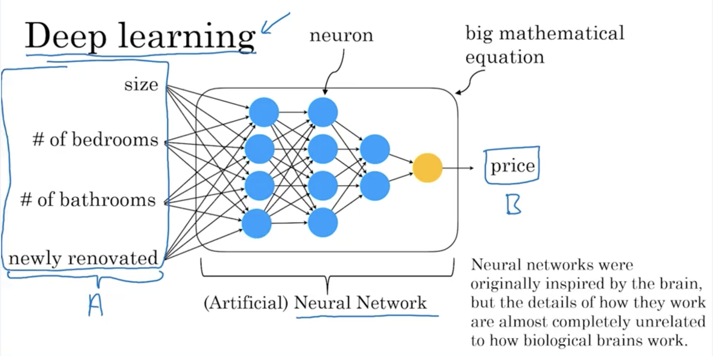

# Semana 1 – Terminologia: AI, ML, DL e Data Science

## Diferenças entre os termos

### 🧠 AI (Inteligência Artificial)
- Campo mais amplo: busca fazer com que máquinas se comportem de maneira “inteligente”.
- Inclui técnicas clássicas além de ML, como planejamento, lógica simbólica, etc.

### 🤖 ML (Machine Learning)
- Subconjunto de AI que permite que computadores aprendam com dados.
- Exemplo: dado um conjunto de dados de casas, aprender a estimar o preço a partir das características (A → B).

> 💡 **Como dev:** Pense no ML como uma função `f(A) -> B` que você *não codifica manualmente*, mas sim *aprende* com base em dados.

### 🧬 DL/NN (Deep Learning / Redes Neurais)
- Subconjunto de ML com redes neurais artificiais, altamente eficaz em tarefas complexas (como visão, fala e linguagem).
- A "profundidade" vem de ter várias camadas ocultas de neurônios artificiais.

> 💬 **Observação:** DL brilha quando você tem **muita** informação (big data) e poder computacional (GPUs). Em sistemas tradicionais, regressão linear pode ser mais interpretável.

### 📊 DS (Data Science)
- Foco em extrair **insights e conhecimento** a partir dos dados.
- Saída comum: apresentações, dashboards, recomendações estratégicas.
- Exemplo: descobrir que casas com 3 quartos são vendidas por 15% a mais que com 2 quartos, mesmo com mesma metragem.

> 🧠 **Dev insight:** Data Science geralmente é mais exploratória, enquanto ML tende a ser mais automatizado e operacional.

---

## Exemplos comparativos

| Situação | É ML? | É DS? |
|---------|-------|-------|
| Prever preço de casa com app automatizado | ✅ | ❌ |
| Estudar se casas reformadas vendem mais caro | ❌ | ✅ |
| Rodar modelo que seleciona anúncios personalizados 24/7 | ✅ | ❌ |
| Analisar se vale contratar mais vendedores para setor de turismo | ❌ | ✅ |

---

## Deep Learning ≠ Cérebro Humano

- Apesar da inspiração biológica, redes neurais artificiais **não funcionam como o cérebro humano**.
- São apenas equações matemáticas complexas que modelam relações não-lineares entre A e B.

---

> 🔍 **Observação importante:** Data Science aparece como área que cruza com AI, ML e DL, mas também possui ferramentas próprias (ex: estatística clássica, visualização de dados, análise exploratória).

---

## Termos adicionais que você ainda ouvirá:

- **Unsupervised Learning**: aprendizado sem rótulos (clustering, PCA, etc).
- **Reinforcement Learning**: aprendizado por tentativa e erro (usado em jogos e robótica).
- **Graphical Models, Knowledge Graphs, Planning**: outras técnicas clássicas ou híbridas.

---

## Conclusão

- **ML** aprende automaticamente A → B.
- **DL/NN** são ferramentas poderosas dentro de ML.
- **DS** busca conhecimento, geralmente não entrega software automatizado.
- Todos esses termos são usados com alguma sobreposição, então o contexto sempre importa.

> ✅ *Como desenvolvedor*, entender essas distinções ajuda a saber quando usar cada ferramenta e como conversar com cientistas de dados e engenheiros de ML com precisão.

---

### Próximo vídeo: o que faz uma empresa ser "boa em IA".

