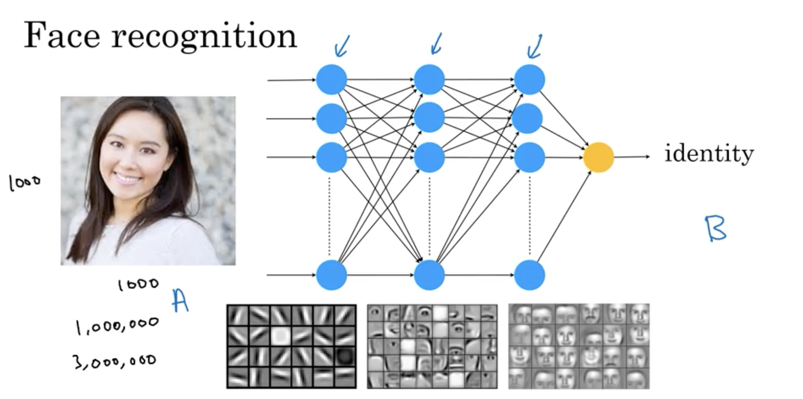

# Semana 1 – O que são Redes Neurais e Deep Learning

## Deep Learning e Redes Neurais

- Os termos *deep learning* e *neural network* são usados quase como sinônimos.
- Representam modelos compostos por múltiplos "neurônios artificiais" empilhados.
- São altamente eficazes para tarefas complexas de predição com muitos dados.

---

## Exemplo simples: Previsão de demanda

- **Objetivo:** prever quantas camisetas serão vendidas com base no preço.
- **Entrada (A):** preço da camiseta  
- **Saída (B):** demanda esperada  
- Um único neurônio artificial pode gerar uma curva simples (ex: linear decrescente com saturação em zero).

---

## Exemplo mais complexo

**Outras variáveis consideradas:**
- Preço
- Custo de envio
- Gasto com marketing
- Tipo de material da camiseta

**Rede neural modela:**
1. **Acessibilidade:** função do preço + frete
2. **Consciência de marca (awareness):** função do marketing
3. **Qualidade percebida:** função do preço, marketing e material
4. **Demanda:** função das 3 estimativas anteriores

---

## Características importantes

- Você **não precisa codificar explicitamente** as variáveis intermediárias como “awareness”.
- A rede **aprende automaticamente** essas representações internas com base nos dados.
- Isso reduz o esforço de engenharia de features, desde que os dados sejam de boa qualidade.

---

## Escalabilidade

- Redes neurais reais podem conter milhares ou milhões de neurônios.
- Requerem grande poder computacional (GPUs, TPUs) e muitos dados rotulados.
- Utilizam *backpropagation* e otimização (ex: gradiente descendente) para aprender.

---

## Conclusão

- Redes neurais são como “blocos de LEGO matemáticos” que, combinados, resolvem tarefas complexas.
- Deep learning é eficaz especialmente quando há:
  - Grande volume de dados
  - Função complexa e não linear entre entrada e saída
- O desenvolvedor não precisa entender o modelo internamente em detalhes, mas sim:
  - Preparar dados
  - Escolher uma arquitetura apropriada
  - Treinar e validar o modelo corretamente

---

## Próximo vídeo

- Exemplo mais avançado: uso de redes neurais para reconhecimento facial.

# Semana 1 – Redes neurais aplicadas a reconhecimento facial

## Reconhecimento de imagens por IA

- Tarefa: identificar a pessoa em uma imagem.
- Entrada (A): imagem (ex: foto de rosto)
- Saída (B): identidade da pessoa

---

## Como o computador “vê” a imagem

- Humanos veem olhos, nariz, etc.
- Computadores veem **matrizes de números** (valores de brilho por pixel):
  - Imagem **preto e branco**: 1 valor por pixel
  - Imagem **colorida**: 3 valores por pixel (RGB)
- Exemplo:
  - Uma imagem de 1000×1000 pixels tem:
    - 1.000.000 de valores (grayscale)
    - 3.000.000 de valores (RGB)

---

## Aprendizado automático da rede

- A rede **aprende automaticamente**:
  - Camadas iniciais aprendem a detectar **bordas e contornos**
  - Camadas intermediárias detectam **olhos, nariz, boca**
  - Camadas finais combinam esses elementos para identificar **rostos completos**
- O desenvolvedor **não precisa programar isso manualmente**.

> 🧠 *Como dev:* Essa é a base das CNNs (*Convolutional Neural Networks*), muito usadas em visão computacional. Elas extraem *features* automaticamente conforme os dados e o treino evoluem.

---

## Parêntese sobre entrada massiva de dados

- Embora a estrutura seja a mesma do exemplo anterior (camisetas), a grande diferença aqui é a **quantidade absurda de dados de entrada**.
- Isso exige:
  - **Treinamento intensivo** com muitos exemplos A → B
  - Poder computacional (GPUs)
  - Dados rotulados corretamente

